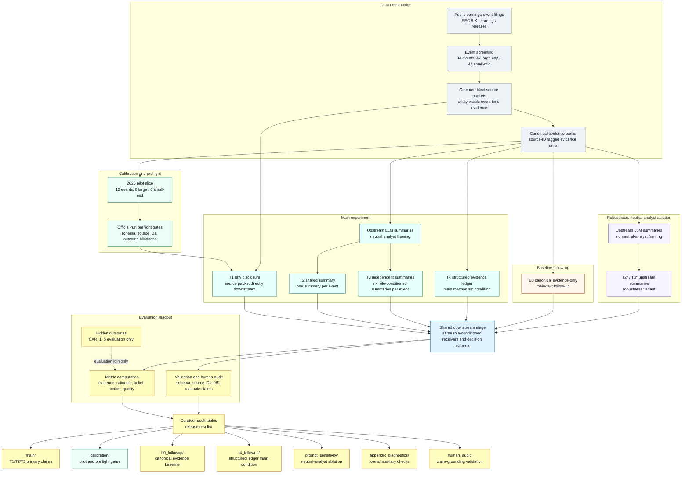

# Faithful to the Frame: Source-Framing Propagation in LLM-Agent Decision Workflows

This repository accompanies the paper **"Faithful to the Frame:
Source-Framing Propagation in LLM-Agent Decision Workflows."**

It contains the data artifacts, treatment definitions, result tables, and
reproducibility metadata/code references used to study source-framing propagation in
LLM-agent decision workflows. The project introduces an evidence-to-action
propagation (E2A) evaluation: given public earnings-event source material, it
traces how different evidence representations affect what LLM receivers cite,
reason from, believe, and decide.

The full operational workspace contains provider runs, repair attempts, batch
status directories, local caches, and intermediate scratch files. Those are not
part of this release directory. This directory provides the clean artifact map:
where the paper's main datasets, treatment families, result tables, and
follow-up analyses are located.

## What This Repository Contains

The experiment studies how institutionally authored source framing propagates
through LLM-mediated evidence interfaces into downstream investment decisions.

The core pipeline is:

1. collect public earnings-event source material
2. build outcome-blind source packets and canonical evidence banks
3. render treatment inputs from the same evidence substrate
4. run pilot calibration and preflight checks before main execution
5. run downstream decision agents under different representations
6. validate schema, source-ID grounding, and free-form rationale claims
7. compute diversity, belief, action, and quality metrics
8. report main results and follow-up mechanism/robustness checks



## Dataset

The main experiment uses 94 earnings-event observations from public,
entity-visible SEC filing materials:

- 47 large-cap events
- 47 small/mid-cap events
- one event per issuer
- event window: accepted at or after 2026-01-01
- primary evaluation outcome: CAR_1_5

Entity-visible means that company identities and event dates may be visible in
the released source material. The relevant experimental separation is that
hidden outcomes are not part of the model-facing source packets, treatments,
upstream summaries, or downstream prompts.

## Representation Regimes

| Regime | Role in paper | Description |
| --- | --- | --- |
| T1 | main baseline | Raw disclosure/source packet passed directly downstream. |
| T2 | main treatment | Shared upstream summary: one summary per event shared by downstream agents. |
| T3 | main treatment | Independent upstream summaries: six role-conditioned summaries are generated per event, so each downstream role condition receives its own summary. |
| B0 | main-text follow-up | Canonical evidence-only baseline, used to separate source framing from synthesis effects. |
| T4 | main mechanism condition | Structured evidence ledger, used to test whether a more explicit evidence structure changes the bottleneck. |
| T2*/T3* | robustness | Upstream-summary variants that remove the neutral-analyst framing from T2/T3. |

## Regime And Downstream Decision Counts

All regimes enter the same downstream stage: the same role-conditioned receiver
definitions, decision schema, and metric computation are used across main,
follow-up, and robustness conditions. The table below separates representation
construction from downstream decision counts.

| Regime | Representation construction over 94 events | Downstream decision count | Count basis | Role |
| --- | --- | ---: | --- | --- |
| T1 | 94 raw source packets; no upstream LLM generation | 2,256 | 94 events x 6 roles x 4 downstream model families x 1 direct source condition seed | Main baseline |
| T2 | 94 shared neutral-analyst upstream summaries | 9,024 | 94 events x 6 roles x 4 downstream model families x 4 upstream summary model families | Main shared-summary condition |
| T3 | 564 neutral-analyst upstream summaries; 6 role-conditioned summaries per event | 9,024 | 94 events x 6 roles x 4 downstream model families x 4 upstream summary model families | Main independent-summary condition |
| T4 | 94 deterministic structured evidence ledgers; no upstream LLM generation | 9,024 | 94 events x 6 roles x 4 downstream model families x 4 ledger-rendering/model-family cells | Main mechanism condition |
| B0 | 94 deterministic canonical evidence-only renderings; no upstream LLM generation | 2,256 | 94 events x 6 roles x 4 downstream model families x 1 canonical evidence condition seed | Main-text baseline follow-up |
| T2* | 94 upstream summaries with neutral-analyst framing removed | 9,024 | same downstream design as T2 | Robustness: neutral-analyst ablation |
| T3* | 564 upstream summaries with neutral-analyst framing removed; 6 role-conditioned summaries per event | 9,024 | same downstream design as T3 | Robustness: neutral-analyst ablation |

The T1/T2/T3/T4 downstream counts are reported in
`results/t4_followup/quality_by_treatment_with_t4.csv`. B0 and T2*/T3* use the
same downstream stage and are summarized in their corresponding result-table
groups.

## Current Release Layout

```text
release/
  README.md
  code/
    README.md
    code_manifest.csv
    scripts/
      treatments.py
      metrics.py
  results/
    result_table_manifest.csv
    main/
    calibration/
    b0_followup/
    t4_followup/
    prompt_sensitivity/
    appendix_diagnostics/
    human_audit/
```

`results/result_table_manifest.csv` lists every released table, row count,
SHA-256 checksum, table role, and paper-claim mapping.

`code/` contains a compact public reference implementation for treatment
rendering and metric computation. It intentionally excludes provider batch
submission, repair, rescue, local cache, and one-off operational scripts.

## Results By Paper Claim

### Calibration And Preflight

Location:

```text
results/calibration/
```

Key files:

- `pilot_selection_summary.csv`
- `pilot_eval_summary.csv`
- `pilot_hypothesis_summary.csv`
- `pilot_primary_metric_detail.csv`
- `pilot_t4_serialization_stats.csv`

The calibration layer records how the main execution was gated before provider
spend. The released calibration subset focuses on the 2026 pilot slice summary
and the official-run preflight checks because those are directly tied to the
final 94-event main run. The 2026 pilot slice contains 12 events, balanced 6
large-cap / 6 small-mid-cap. These artifacts were used to check treatment
construction, source-ID grounding, outcome blindness, provider plumbing, and
metric behavior before the 94-event main run. The full pilot selection audit is
not included here because it contains evaluation-only outcome joins. The
outcome-blindness gate produced zero findings, so the empty finding table is
not included as a standalone release file.

A separate 2025 calibration pass was used internally while developing the
pipeline, but it is not included in this curated release subset because it is
not a main-result artifact and would distract from the final execution path.
Internal pilot/preflight working notes are also not included in this release;
the release keeps only compact readout artifacts and the top-level artifact map.

These are design and QA artifacts. They should be used to understand why the
main run was considered ready, not as the paper's main confirmatory estimates.

### Main Results: T1/T2/T3 Evidence-to-Action Bottleneck

Location:

```text
results/main/
```

Key tables:

- `stage2_t2_t3_primary_full.csv`: primary T2 vs T3 contrasts for belief,
  rationale, source, category, and action metrics.
- `stage2_quality_by_treatment_full.csv`: treatment-level quality guardrails.
- `stage1_summary_full.csv`: Stage 1 source/evidence compression summary.
- `stage2_by_model_cell_full.csv`: model-cell breakdown.

Use these tables for the paper's main claims about shared vs independent
summaries and whether representation changes diversity without obvious quality
collapse.

### B0 Follow-Up: Canonical Evidence-Only Baseline

Location:

```text
results/b0_followup/
```

Key tables:

- `b0_treatment_contrasts_20260510.csv`
- `b0_downstream_treatment_means_20260510.csv`
- `b0_by_receiver_model_20260510.csv`

B0 is a main-text follow-up. It is not just an appendix table. It helps
separate effects caused by source framing from effects caused by LLM synthesis.

### T4 Main Mechanism Condition: Structured Evidence Ledger

Location:

```text
results/t4_followup/
```

Key tables:

- `t4_full_treatment_means.csv`
- `t4_full_event_bootstrap_contrasts.csv`
- `quality_by_treatment_with_t4.csv`

T4 is part of the main experiment as a mechanism-oriented condition. It tests
whether a fuller structured evidence ledger changes the observed
evidence-to-action bottleneck.

### Prompt Sensitivity: No Neutral-Analyst T2/T3

Location:

```text
results/prompt_sensitivity/
```

Key tables:

- `treatment_means_t2star_t3star.csv`
- `t2_t3_prompt_style_side_by_side.csv`
- `action_distribution_no_style_minus_neutral_deltas.csv`

T2*/T3* are upstream-summary variants that remove the neutral-analyst framing
from T2/T3. The intervention happens at the upstream summary generation stage,
before downstream decision agents receive the T2*/T3* representations. The key
ablation is the removal of the neutral-analyst role/framing, not a generic
change in writing style. These should be interpreted as robustness variants of
T2/T3, not as a separate baseline family.

### Appendix Diagnostics

Location:

```text
results/appendix_diagnostics/
```

Key tables:

- `belief_mad_contrasts_event_bootstrap.csv`
- `category_diversity_contrasts_event_bootstrap.csv`
- `profile_separability_formal_event_bootstrap.csv`
- `reasoning_contrasts.csv`

These tables support formal or auxiliary diagnostics used in the appendix and
paper robustness discussion.

### Human Audit: Claim Grounding And Leakage Check

Location:

```text
results/human_audit/
```

Key files:

- `audit_protocol.csv`
- `canonical_evidence_audit_summary.csv`
- `downstream_claim_grounding_summary.csv`
- `second_pass_material_or_leakage_rows.csv`

The released human-audit subset has three parts:

1. a compact audit protocol describing the audit scopes, labels, released
   details, and the fact that no inter-annotator agreement claim is made;
2. aggregate canonical evidence validity counts over evidence alignment,
   numeric fidelity, claim fidelity, quote fidelity, category fit,
   support-label fit, and post-event leakage;
3. aggregate downstream claim-grounding counts by overall, treatment family,
   and model family, plus the small subset of material unsupported or
   post-event-leakage rows.

The full row-level human-audit sheets are not included in this curated
release subset. They contain large rendered source excerpts and
row-level adjudication details that are useful for local reproducibility but
unnecessary for the clean review surface. This release keeps reviewer-readable
aggregate summaries and a compact material-failure subset needed to evaluate
the paper's construct-validity claims.

The downstream audit checks whether free-form decision rationales are grounded
in visible source evidence and whether they contain unsupported factual claims
or post-event leakage.

The final downstream claim-grounding second-pass audit covers 961 rationale
claims.

Final second-pass summary:

- 903/961 claims labeled `no_hallucination` (93.96%)
- 40/961 claims labeled `minor_unsupported_detail` (4.16%)
- 17/961 claims labeled `material_unsupported_claim` (1.77%)
- 1/961 claim labeled `post_event_leakage` (0.10%)

This audit supports the construct-validity claim that source grounding strongly
constrains free-form rationales while not eliminating unsupported claims
entirely.

## Outcome And Input Boundary

Model-facing artifacts are built from public event-time source materials and
derived treatments. They should not include:

- CAR_1_5 labels
- post-event price reactions
- ex post quality labels
- evaluation-only joins that reveal outcome direction

If evaluation outcomes are included in a later release stage, they should be
placed under an explicit `evaluation_only/` directory and documented separately
from model-facing inputs.

## Excluded Operational Artifacts

The following artifact classes are deliberately not part of this release map:

- raw provider batch status directories
- repair/rebatch/rescue scratch directories
- local caches
- empty or historical error shards
- operational logs
- full raw downstream provider traces without a trace manifest

These files may be useful for local reproducibility archaeology, but they are
not the clean artifact surface for understanding the paper.

## Rebuilding The Release Subset

From the repository root:

```bash
python3 scripts/build_reviewer_result_release.py
```

The builder copies the allowlisted result, calibration, and audit artifacts into
`release/results/` and regenerates `results/result_table_manifest.csv` with row
counts and checksums.
