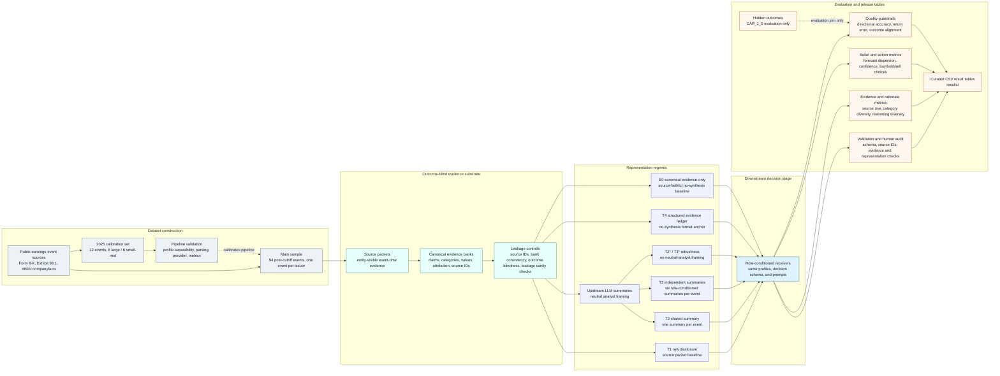

# Faithful to the Frame: Source-Framing Propagation in LLM-Agent Decision Workflows

This repository accompanies the paper **"Faithful to the Frame:
Source-Framing Propagation in LLM-Agent Decision Workflows."**

It contains the data artifacts, treatment definitions, result tables, and
execution code used to study source-framing propagation in LLM-agent decision
workflows. The project introduces an evidence-to-action
propagation (E2A) evaluation: given public earnings-event source material, it
traces how different evidence representations affect what LLM receivers cite,
reason from, believe, and decide.

The full operational workspace contains raw provider outputs, batch status
logs, local caches, and intermediate operational files. Those are not part of
this artifact. This repository provides the clean reproducibility surface:
model-facing inputs, evaluation-only labels, runnable pipeline code, curated
result tables, and the audit subset used by the paper.

## What This Repository Contains

The experiment studies how institutionally authored source framing propagates
through LLM-mediated evidence interfaces into downstream investment decisions.

The core pipeline collects public earnings-event source material, validates the
pipeline on a 12-event November-December 2025 calibration set, constructs the
94-event post-cutoff main sample, renders representation regimes from the same
outcome-blind evidence substrate, runs role-conditioned downstream receivers,
and computes evidence, rationale, belief, action, and quality readouts.



## Dataset

The main experiment uses 94 earnings-event observations from public,
entity-visible SEC filing materials:

- 47 large-cap events
- 47 small/mid-cap events
- one event per issuer
- event window: accepted at or after 2026-01-01
- primary evaluation outcome: CAR_1_5

Entity-visible means that company identities and event dates may be visible in
the released source material. The relevant experimental separation is that
hidden outcomes are not part of the model-facing source packets, treatments,
upstream summaries, or downstream prompts.

## Representation Regimes

| Regime | Role in paper | Description |
| --- | --- | --- |
| T1 | main baseline | Raw disclosure/source packet passed directly downstream. |
| T2 | main treatment | Shared upstream summary: one summary per event shared by downstream agents. |
| T3 | main treatment | Independent upstream summaries: six role-conditioned summaries are generated per event, so each downstream role condition receives its own summary. |
| B0 | main-text follow-up | Canonical evidence-only baseline, used to separate source framing from synthesis effects. |
| T4 | main mechanism condition | Structured evidence ledger, used to test whether a more explicit evidence structure changes the bottleneck. |
| T2*/T3* | robustness | Upstream-summary variants that remove the neutral-analyst framing from T2/T3. |

## Regime And Downstream Decision Counts

All regimes enter the same downstream stage: the same role-conditioned receiver
definitions, decision schema, and metric computation are used across main,
follow-up, and robustness conditions. The table below separates representation
construction from downstream decision counts.

| Regime | Representation construction over 94 events | Downstream decision count | Count basis | Role |
| --- | --- | ---: | --- | --- |
| T1 | 94 raw source packets; no upstream LLM generation | 2,256 | 94 events x 6 roles x 4 downstream model families x 1 direct source condition seed | Main baseline |
| T2 | 94 shared neutral-analyst upstream summaries | 9,024 | 94 events x 6 roles x 4 downstream model families x 4 upstream summary model families | Main shared-summary condition |
| T3 | 564 neutral-analyst upstream summaries; 6 role-conditioned summaries per event | 9,024 | 94 events x 6 roles x 4 downstream model families x 4 upstream summary model families | Main independent-summary condition |
| T4 | 94 deterministic structured evidence ledgers; no upstream LLM generation | 9,024 | 94 events x 6 roles x 4 downstream model families x 4 ledger-rendering/model-family cells | Main mechanism condition |
| B0 | 94 deterministic canonical evidence-only renderings; no upstream LLM generation | 2,256 | 94 events x 6 roles x 4 downstream model families x 1 canonical evidence condition seed | Main-text baseline follow-up |
| T2* | 94 upstream summaries with neutral-analyst framing removed | 9,024 | same downstream design as T2 | Robustness: neutral-analyst ablation |
| T3* | 564 upstream summaries with neutral-analyst framing removed; 6 role-conditioned summaries per event | 9,024 | same downstream design as T3 | Robustness: neutral-analyst ablation |

The T1/T2/T3/T4 downstream counts are reported in
`results/t4_mechanism/quality_by_treatment_with_t4.csv`. B0 and T2*/T3* use the
same downstream stage and are summarized in their corresponding result-table
groups.

## Repository Layout

```text
.
├── README.md
├── code/
│   ├── README.md
│   ├── requirements.txt
│   ├── config.example.json
│   ├── config.full_rerun.example.json
│   ├── env.example
│   ├── code_manifest.csv
│   ├── schemas/
│   │   └── experiment_schema.json
│   ├── examples/
│   └── scripts/
│       ├── run_experiment.py
│       ├── render_treatments.py
│       ├── run_representation_harness.py
│       ├── build_downstream_requests.py
│       ├── run_downstream_harness.py
│       ├── validate_decision_outputs.py
│       └── compute_diversity_metrics.py
├── data/
│   ├── model_facing/
│   │   └── main_94/
│   │       ├── source_packets/
│   │       ├── canonical_evidence_banks/
│   │       └── sample_manifest.csv
│   └── evaluation_only/
│       └── car_1_5_outcomes.csv
├── manifests/
│   └── artifact_manifest.csv
├── prompts/
│   ├── prompt_templates.md
│   ├── prompt_manifest.csv
│   └── upstream_prompt_jobs/
└── results/
    ├── result_table_manifest.csv
    ├── traces/
    ├── main/
    ├── calibration/
    ├── b0_followup/
    ├── t4_mechanism/
    ├── prompt_sensitivity/
    ├── appendix_diagnostics/
    └── human_audit/
```

`results/result_table_manifest.csv` lists every released table, row count,
SHA-256 checksum, table role, and paper-claim mapping.

`code/` contains the cleaned public execution path for running the experiment:
treatment rendering, upstream-summary execution, downstream decision-request
construction, downstream decision execution, output validation, and metric
computation. `data/model_facing/main_94/` contains the released outcome-blind
model-facing inputs. `data/evaluation_only/` contains the CAR_1_5 outcome file
used only during metric computation.

## Result Tables At A Glance

The released result tables are ordinary CSV files under `results/`. The full
index is `results/result_table_manifest.csv`, which lists each table's row
count, checksum, role, and paper-claim mapping.

| Paper component | Primary table(s) |
| --- | --- |
| T1/T2/T3 main results | `results/main/stage2_t2_t3_primary_full.csv` |
| Main quality guardrails | `results/main/stage2_quality_by_treatment_full.csv` |
| Upstream representation compression | `results/main/stage1_summary_full.csv` |
| Model-cell breakdown | `results/main/stage2_by_model_cell_full.csv` |
| T4 structured-ledger mechanism condition | `results/t4_mechanism/t4_full_treatment_means.csv`; `results/t4_mechanism/t4_full_event_bootstrap_contrasts.csv`; `results/t4_mechanism/quality_by_treatment_with_t4.csv` |
| B0 canonical-evidence follow-up | `results/b0_followup/b0_treatment_contrasts_20260510.csv`; `results/b0_followup/b0_downstream_treatment_means_20260510.csv`; `results/b0_followup/b0_by_receiver_model_20260510.csv` |
| T2*/T3* prompt-sensitivity robustness | `results/prompt_sensitivity/treatment_means_t2star_t3star.csv`; `results/prompt_sensitivity/t2_t3_neutral_ablation_side_by_side.csv`; `results/prompt_sensitivity/action_distribution_no_neutral_minus_neutral_deltas.csv` |
| Appendix diagnostics | `results/appendix_diagnostics/belief_mad_contrasts_event_bootstrap.csv`; `results/appendix_diagnostics/category_diversity_contrasts_event_bootstrap.csv`; `results/appendix_diagnostics/profile_separability_formal_event_bootstrap.csv`; `results/appendix_diagnostics/reasoning_contrasts.csv` |
| Human audit | `results/human_audit/audit_protocol.csv`; `results/human_audit/canonical_evidence_audit_sheet.csv`; `results/human_audit/cross_treatment_representation_audit_sheet.csv` |
| 2025 calibration | `results/calibration/calibration_2025_selection_summary.csv`; `results/calibration/calibration_2025_selected_events.csv`; `results/calibration/calibration_2025_provider_metric_summary.csv`; `results/calibration/calibration_2025_profile_stochasticity_summary.csv` |

## Analysis-Level Traces

`results/traces/` contains canonicalized analysis-level traces behind the
released result tables. These files are evaluation artifacts, not model-facing
inputs: they include joined CAR_1_5 outcomes and derived accuracy/error fields.

The trace release includes:

- `results/traces/main_t1_t2_t3/`: decision rows and cell metrics for the main
  T1/T2/T3 downstream run.
- `results/traces/t4_b0_mechanism/`: decision rows and cell metrics for T4 and
  B0 alongside T1/T2/T3.
- `results/traces/prompt_sensitivity_t2star_t3star/`: decision rows and cell
  metrics for the T2*/T3* no-neutral-analyst robustness run.
- `results/traces/trace_manifest.csv`: row counts, file sizes, checksums, and
  paper-claim mappings for the trace files.

Raw provider JSONL, batch status logs, retry and batch-bookkeeping files, local
caches, and operational request logs are excluded. The released traces are the
post-validation analysis tables used to inspect decisions, cited evidence IDs,
actions, rationales, outcome joins, and metric inputs.

## Prompt Artifacts

`prompts/` documents the prompt surface used by the experiment:

- `prompts/prompt_templates.md` records the upstream summary and downstream
  decision prompt templates.
- `prompts/upstream_prompt_jobs/` contains the complete upstream T2/T3 prompt
  jobs for the main neutral-analyst run and the T2*/T3* no-neutral robustness
  run.
- `prompts/prompt_manifest.csv` lists prompt-job row counts, file sizes, and
  checksums.

Full downstream request JSONL bundles are not released because they are large
operational files with substantial duplicated treatment text. They can be
regenerated with `code/scripts/build_downstream_requests.py`; the validated
post-response analysis rows used for metric computation are released under
`results/traces/`.

To run a credential-free capped mock execution from the release root:

```bash
python3 code/scripts/run_experiment.py \
  --config code/config.example.json \
  --work-dir runs/main_94_mock \
  --mode mock \
  --overwrite
```

For provider-backed reruns, set an API key and edit
`code/config.full_rerun.example.json`. Provider batch submission, retry
bookkeeping, local caches, and one-off operational scripts are intentionally
excluded.

## Results By Paper Claim

### Calibration

Location:

```text
results/calibration/
```

Key files:

- `calibration_2025_selection_summary.csv`
- `calibration_2025_selected_events.csv`
- `calibration_2025_provider_metric_summary.csv`
- `calibration_2025_profile_stochasticity_summary.csv`

The 2025 near-cutoff calibration set contains 12 events from 2025-11-01 to
2025-12-31, balanced 6 large-cap / 6 small-mid-cap. Following the paper, it is
used for pipeline validation and profile-separability checks. It is not part of
the 94-event 2026+ main sample and is excluded from all primary estimates.

The full 2025 calibration working directories contain provider outputs, hidden
outcome joins, and local operational paths. The release keeps compact CSV
readouts and selected-event metadata with internal paths omitted. These are
design and QA artifacts, not confirmatory main-result estimates.

### Main Results: T1/T2/T3 Evidence-to-Action Bottleneck

Location:

```text
results/main/
```

Key tables:

- `stage2_t2_t3_primary_full.csv`: primary T2 vs T3 contrasts for belief,
  rationale, source, category, and action metrics.
- `stage2_quality_by_treatment_full.csv`: treatment-level quality guardrails.
- `stage1_summary_full.csv`: Stage 1 source/evidence compression summary.
- `stage2_by_model_cell_full.csv`: model-cell breakdown.

Use these tables for the paper's main claims about shared vs independent
summaries and whether representation changes diversity without obvious quality
collapse.

### B0 Follow-Up: Canonical Evidence-Only Baseline

Location:

```text
results/b0_followup/
```

Key tables:

- `b0_treatment_contrasts_20260510.csv`
- `b0_downstream_treatment_means_20260510.csv`
- `b0_by_receiver_model_20260510.csv`

B0 is a main-text follow-up. It is not just an appendix table. It helps
separate effects caused by source framing from effects caused by LLM synthesis.

### T4 Main Mechanism Condition: Structured Evidence Ledger

Location:

```text
results/t4_mechanism/
```

Key tables:

- `t4_full_treatment_means.csv`
- `t4_full_event_bootstrap_contrasts.csv`
- `quality_by_treatment_with_t4.csv`

T4 is part of the main experiment as a mechanism-oriented condition. It tests
whether a fuller structured evidence ledger changes the observed
evidence-to-action bottleneck.

### Prompt Sensitivity: No Neutral-Analyst T2/T3

Location:

```text
results/prompt_sensitivity/
```

Key tables:

- `treatment_means_t2star_t3star.csv`
- `t2_t3_neutral_ablation_side_by_side.csv`
- `action_distribution_no_neutral_minus_neutral_deltas.csv`

T2*/T3* are upstream-summary variants that remove the neutral-analyst framing
from T2/T3. The intervention happens at the upstream summary generation stage,
before downstream decision agents receive the T2*/T3* representations. The key
ablation is the removal of the neutral-analyst role/framing, not a generic
change in writing style. These should be interpreted as robustness variants of
T2/T3, not as a separate baseline family.

### Appendix Diagnostics

Location:

```text
results/appendix_diagnostics/
```

Key tables:

- `belief_mad_contrasts_event_bootstrap.csv`
- `category_diversity_contrasts_event_bootstrap.csv`
- `profile_separability_formal_event_bootstrap.csv`
- `reasoning_contrasts.csv`

These tables support formal or auxiliary diagnostics used in the appendix and
paper robustness discussion.

### Human Audit: Evidence And Representation Validity Checks

Location:

```text
results/human_audit/
```

Key files:

- `audit_protocol.csv`
- `canonical_evidence_audit_sheet.csv`
- `cross_treatment_representation_audit_sheet.csv`

The released human-audit subset has three parts:

1. a compact audit protocol describing the audit scopes, labels, released
   details, and the fact that no inter-annotator agreement claim is made;
2. a row-level canonical evidence audit covering 62 evidence units, with
   public source excerpts and judgments for source alignment, numeric fidelity,
   claim fidelity, quote fidelity, category fit, support-label fit, and
   post-event leakage;
3. a row-level cross-treatment representation audit covering 4 rendered
   treatment representations, with rendered text, cited source IDs, validity
   checks, and audit notes.

The row-level sheets are released directly rather than only as aggregate
summaries. Audit annotator identity and internal pipeline path columns are omitted
from the public CSVs, but the substantive audit content is retained. No
inter-annotator agreement claim is made.

The audit supports the construct-validity claim that the released evidence
banks and treatment representations can be inspected against visible,
event-time public source material, and that post-event leakage and unsupported
material claims were explicitly checked.

## Outcome And Input Boundary

Model-facing artifacts are built from public event-time source materials and
derived treatments. They should not include:

- CAR_1_5 labels
- post-event price reactions
- ex post quality labels
- evaluation-only joins that reveal outcome direction

If evaluation outcomes are included in a later release stage, they should be
placed under an explicit `evaluation_only/` directory and documented separately
from model-facing inputs.

## Excluded Operational Artifacts

The following artifact classes are deliberately not part of this artifact:

- raw provider batch status directories
- retry and batch-bookkeeping directories
- local caches
- empty or historical error shards
- operational logs
- full raw downstream provider traces without a trace manifest

These files may be useful for local reproducibility archaeology, but they are
not the clean artifact surface for understanding the paper.
